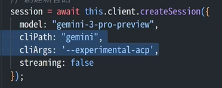
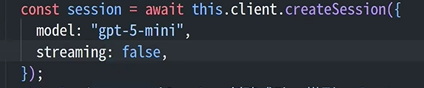
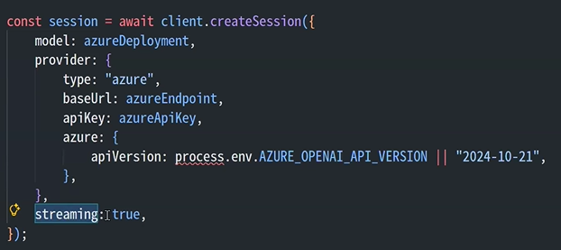
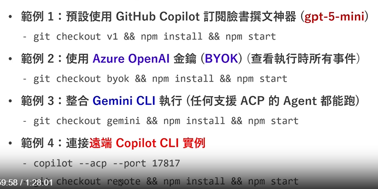

# Copilot SDK 串接方式整理 (Connection Methods)

本文件整理了四種主要的 Copilot SDK 串接與連線方式，涵蓋 Gemini CLI、Copilot CLI、BYOK 以及連接遠端。

---

## 1. 整合 Gemini CLI 執行
此方式透過 Gemini CLI 進行串接，支援任何相容於 ACP (Agent Communication Protocol) 的 Agent。

### 程式碼範例
```javascript
session = await this.client.createSession({
  model: "gemini-3-pro-preview",
  cliPath: "gemini",
  cliArgs: "--experimental-acp",
  streaming: false
});
```



### 執行指令
```bash
git checkout gemini && npm install && npm start
```

---

## 2. 預設方式：GitHub Copilot 訂閱 (Copilot CLI)
這是最基本的串接方式，直接使用您現有的 GitHub Copilot 訂閱權限。

### 程式碼範例
```javascript
const session = await this.client.createSession({
  model: "gpt-5-mini",
  streaming: false,
});
```



### 執行指令
```bash
git checkout v1 && npm install && npm start
```

---

## 3. 使用 Azure OpenAI 金鑰 (BYOK - Bring Your Own Key)
當您需要使用自己的 Azure OpenAI 服務以獲得更多監控或特定模型支援時使用時。

### 程式碼範例
```javascript
const session = await client.createSession({
  model: azureDeployment,
  provider: {
    type: "azure",
    baseUrl: azureEndpoint,
    apiKey: azureApiKey,
    azure: {
      apiVersion: process.env.AZURE_OPENAI_API_VERSION || "2024-10-21",
    },
  },
  streaming: true,
});
```



### 執行指令
```bash
git checkout byok && npm install && npm start
```

---

## 4. 連接遠端 Copilot CLI 實例
當 Copilot CLI 正在特定連接埠（例如 17817）執行時，您可以從遠端進行連接。

### 執行指令
1. **啟動遠端服務：**
   ```bash
   copilot --acp --port 17817
   ```
2. **切換分支並啟動：**
   ```bash
   git checkout remote && npm install && npm start
   ```

---

## 總覽圖示 (Overview)
下圖彙整了上述四種範例的對應分支與啟動方式：


