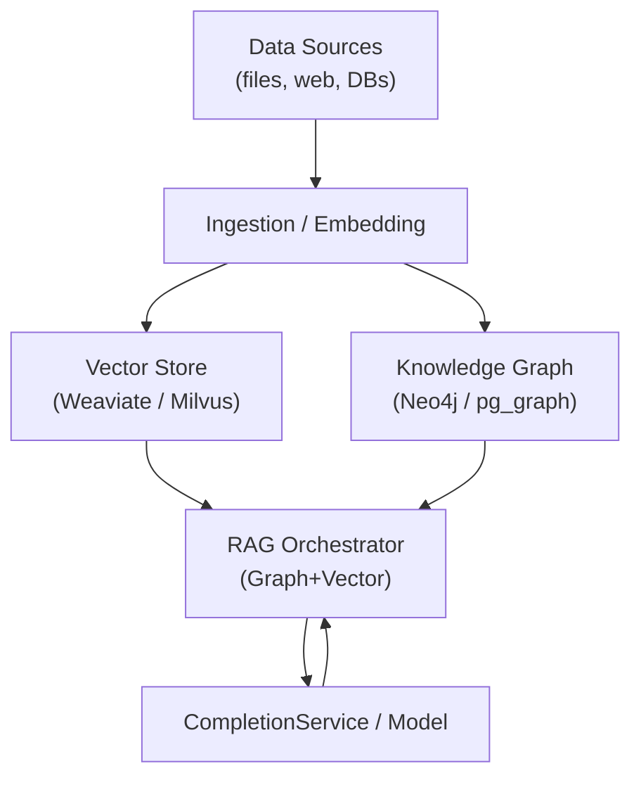

# DeepWiki Architecture Mapping — Github_Copilot_SDK_addin

## 概要
本文件將本專案對應到 DeepWiki 架構的各層級，並以流程圖說明主要呼叫路徑，最後提供可行的優化建議。

## 架構對應
- Entry / Orchestrator: `ServerOrchestrator` — server 啟動與生命週期管理（server/ecosystems/server-entry.ts, server/organisms/server-orchestrator.ts）
- API / Gateway: Express 路由與 API（server/molecules/app-factory.ts, server/routes/organisms/api-router.ts）
- Auth / ACP Connectors: `acp/validate` 與 `resolveACPOptions`（server/routes/organisms/api-router.ts + services/copilot/molecules）
- Model Service / Prompt Orchestration: `CompletionService`, `PromptOrchestrator`, `sdk-provider`（server/services/copilot/organisms）
- SDK & Client Management: `client-manager`, `option-resolver`, `sdk-orchestrator-v2`（server/services/copilot/molecules + organisms）
- Streaming / SSE: `handleCopilotRequest`（server/routes/organisms/copilot-handler.ts）
- Frontend Orchestration (Taskpane): `ChatOrchestrator`, `api-orchestrator`, UI components（src/taskpane/...）
- Dev tooling & patches: `scripts/patch-copilot-sdk.mjs`, `scripts/dev-win.mjs`, `patches/`（scripts/ & patches/）
- Config & Secrets: `server/config/*`（環境與金鑰管理）

## Mermaid 流程圖
```mermaid
flowchart TD
  U[User (Taskpane UI)] -->|send prompt| F[Frontend ChatOrchestrator]
  F -->|POST /api/copilot| API[Express API Router]
  API -->|resolve ACP/options| AC[ACP Resolver & Client Manager]
  API -->|invoke| CS[CompletionService]
  CS -->|branch: github_models| GM[GitHub Models REST]
  CS -->|branch: gemini_api| GS[Gemini REST]
  CS -->|branch: copilot_sdk| SDK[Copilot SDK Orchestrator]
  SDK --> CM[Client Manager & CLI Agent]
  CM -->|stream/chunks| API
  API -->|SSE stream| F
  F -->|apply| W[Word / Office Integration]
  note right of SDK: warmUpClient, health checks
  note left of AC: acp/validate (azure_byok / gemini_cli / copilot_cli)
```

## 優化建議（依優先順序）
1. 新增 Knowledge Store（向量 DB）與 ingestion pipeline：在 `server/services/knowledge` 下實作向量化 adapter（FAISS / Weaviate / Milvus）與 ingestion 工具，支援 RAG。  
2. 建立 document ingestion ETL：加入 `scripts/ingest`，包含分段、embedding、metadata tag、同步機制（可排程或 webhook）。  
3. 擴充 ACP 審計與會話追蹤：每次 `acp/validate` 與模型呼叫都寫入 audit log（user, method, cost, latency），便於使用與費用控管。  
4. 增加容錯測試：為 SSE 中斷、token refresh 與 CLI agent 崩潰建立重試策略與整合測試。  
5. 抽出通用 Prompt Template 管理：將 `PromptOrchestrator` 的 presets 與模板明確化、版本化。  
6. 文件化開發流程：在 repo 加入 `docs/ingest.md` 與 `docs/acp-overview.md`，並在 `package.json` 加入 `npm run ingest:dev` 腳本。  
7. 優化服務路由與降級策略：在 `CompletionService` 加入多模型、異常模式的分流與 fallback 方案（GitHub Model / Gemini / Copilot SDK），並加上延遲 / 成本優先算價判定。  
8. 建置端到端指標儀表板：整合 `server/services/logging` 與 `server/services/metrics`（或 Prometheus / Grafana），衡量延遲、SSE 凍結率、token 耗用及復原時間；定義 SLO。  
9. 強化安全性與權限控管：在 `api-router` 增加 RBAC、速率限制、payload 驗證，並在 `acp/validate` 加上 CASB policy 與敏感詞掃描。  
10. 多語/本地化支援：擴充 Taskpane 與後端 NLP pipeline，分辨語系並選用適當模型，或在 RAG 時採用多語知識庫。  

## 建議的第一個小任務
- 新增 `server/services/knowledge/README.md` 與一個最小向量 adapter（檔案 `server/services/knowledge/vector-adapter-fake.ts`），以便快速 prototype RAG。

## 三層架構 — Graph RAG（建議實作）
本段提出一個三層（Ingest → Knowledge Graph + Vector Store → Orchestration）實作藍圖，方便將文件與結構化知識合併，提供更精準的 RAG 回應。

- 第一層：Ingestion & Preprocessing
  - 負責來源蒐集、分段（chunking）、metadata tagging、以及 embedding。
  - 建議檔案：`server/services/knowledge/ingest/*`（`ingest-file.ts`, `ingest-web.ts`）與 `scripts/ingest`。
  - 技術：文本清洗、語言檢測、分段（基於句子或語意段落）、embedding（OpenAI/Vertex/FAISS 插件）。

- 第二層：Hybrid Knowledge Layer（Graph + Vector）
  - 將實體/關係資料建成 Knowledge Graph（例如 Neo4j / Postgres Graph / JanusGraph），並將段落向量存於 Vector DB（Weaviate / Milvus / FAISS）。
  - 設計：每個 chunk 同時帶有 `text`, `embedding`, `entity_ids`, `source`, `timestamp`, `confidence`，以利跨層檢索與溯源。
  - 建議檔案：`server/services/knowledge/graph-adapter.ts`, `server/services/knowledge/vector-adapter.ts`。

- 第三層：Retrieval & Orchestration（RAG Orchestrator）
  - 檢索流程：先以 Graph query 找到相關實體與關係，再以 Vector NN（kNN）擴展語境，最後合併候選段落並做 re-rank 與 prompt 組裝。
  - 負責：context assembly、prompt template 選擇、模型呼叫（CompletionService）、SSE stream 管理、以及 response provenance。
  - 建議檔案：`server/services/knowledge/graph-rag-orchestrator.ts`（入參：query, userContext, acpOptions）

安全與可觀測性要點：
  - 每次從 Graph/Vector 的取回都帶 lineage metadata，並寫入 `server/services/logging`。
  - 定義 SLO（回答延遲/準確度），在 `server/services/metrics` 暴露指標。

簡單示意圖（Mermaid，已採用解析安全語法）：


實作建議（優先順序）：
  1. 實作 `vector-adapter-fake` 與 `ingest` pipeline（快速驗證 retrieval chain）。
  2. 建一個最小 Graph schema（Entity / Relation / Source），並建立 `graph-adapter` 的 CRUD 與 query 範例。
  3. 在 `graph-rag-orchestrator` 實作混合檢索策略：Graph-first → Vector-expand → Re-rank → Assemble context。
  4. 新增 end-to-end 測試（包含冷啟動與 SSE 中斷恢復場景）。


## ACP 機制補充說明
1. 使用者端透過 Taskpane 選擇 authProvider：`copilot_cli`、`gemini_api`、`azure_byok`。
2. 前端 `sendToCopilot` 發送 POST `/api/copilot`，帶入 `authProvider`、`prompt`、`geminiToken` 等資訊。
3. API Router `/api/copilot` 進入 `handleCopilotRequest`；若需要驗證先走 `/api/acp/validate`、`resolveACPOptions`，按選擇的方式決定：
   - `copilot_cli` -> 本地 `@github/copilot-sdk` CLI 代理，透過 `client-manager` 建立/復用連線。
   - `gemini_cli` -> 本地 Gemini CLI / embedded agent。
   - `azure_byok` -> 直接與 Azure OpenAI / Copilot BYOK token 整合。
4. `CompletionService` 分流：根據 `authProvider` 取不同服務模組，並在必要時啟用 SSE 實時 chunk 回傳。 
5. `copilot-handler` SSE 事件：寫入 `data: {text: chunk}`，前端 `stream-decoder` 解析並展現，最後 invoke `applyOfficeActions` 更新 Word。

## 預期行為（ACP 的核心要點）
- 抽象多種輸入 Token/密鑰管理：`server/config/env.js` 及 `server/config/molecules/server-config.js` 統一權限來源。
- 重用 Session + 連線：`client-manager` 提供 get-or-create 機制減少 CLI 重啟。
- 健康檢查與降級：`sdk-provider` 含 `warmUpClient`、`checkAgentHealth`，若主通路失敗可切換至 REST API。
- 安全記錄：建議透過 `server/services/logging`（或直接 `console`）增觸 `requestId`、`clientMethod` 和 `status`。
- 前端透明化：Taskpane UI 不需關心底層 authProvider 細節，僅展示選項與結果。

## 成長路徑（Office AI 助理對應）
下列成長路徑根據專案現況與圖片概念整理成 5 個階段，並將每階段與 `copilot_sdk_connection_methods/deepwiki-mapping.md` 中的建議對應成可執行任務。

- 階段 1 — 核心基礎（完成 80%）
  - 目標：建立原子化組件（Atoms）、環境驗證與基礎資料持久化。
  - 任務：實作 `server/config` 驗證、`client-manager` 基本生命週期、`server/services/knowledge/vector-adapter-fake`（快速驗證）。

- 階段 2 — 知識擴張（RAG 與向量 DB）
  - 目標：建立長文件檢索、向量資料庫與多文件關聯流程。  
  - 任務：`scripts/ingest`、`server/services/knowledge/ingest`、`vector-adapter`（Weaviate/Milvus plugin）、並新增基本 Graph schema 用於關聯測試。

- 階段 3 — 專業編輯與樣式校閱（引入表格/審校）
  - 目標：支援表格化輸出、樣式校閱、以及批註建議模式。  
  - 任務：在 `PromptOrchestrator` 加入 `tables` 與 `audit` 模板，並於 `graph-rag-orchestrator` 中加入 re-rank 與 context assembly 範例。

- 階段 4 — 智能代理與多模型鏈結（Chaining）
  - 目標：實作多模型鏈結、視覺理解（如有需求）、以及操作快照（Snapshots）。
  - 任務：擴充 `CompletionService` 支援 model-chaining、新增 `sdk-provider` 的 health checks 與降級路由，並建立視覺處理管線（若需要，可添加 `vision-adapter`）。

- 階段 5 — 企業治理與本地化部署（Edge / PII）
  - 目標：企業級治理、隱私遮蔽（PII）、團隊共用庫與本地端 AI 支援。  
  - 任務：在 `api-router` 實作 RBAC 與速率限制、在 `acp/validate` 加入 CASB 與敏感詞掃描；準備 Edge 部署指南與 snapshots 同步策略。

每階段的驗收標準（例）：
  - 階段 2 驗收：完成 ingest pipeline 並能在本地對 10 個文件做向量檢索且回傳候選段落（含來源）。
  - 階段 4 驗收：在 SLO 限制下完成一次 multi-model chain 並回傳 provenance metadata。
