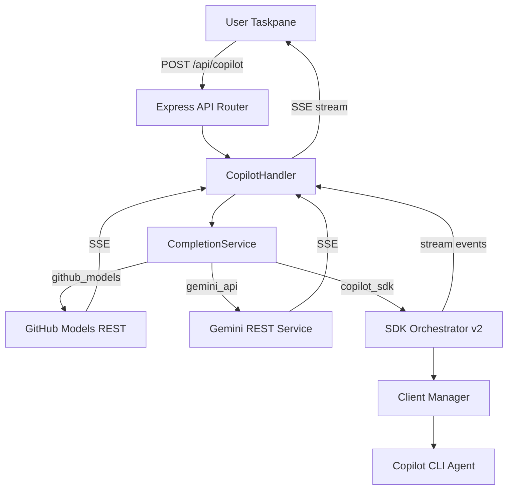

# 001 — 全域架構與優化規畫規格說明 (Global Architecture & Optimization Roadmap)

> **版本**: 2.0 (Master Consolidation)  
> **更新日期**: 2026-03-26  
> **狀態**: 🟢 核心功能已驗證 / 🔄 優化實施中  
> **分支**: `gemini` / `main`

---

## 1. 專案概述 (Project Overview)

**Github_Copilot_SDK_addin** 是一個 Microsoft Office Add-in（Word/Excel/PowerPoint），整合 AI 能力至 Office 應用程式內部。透過 GitHub Copilot SDK、Google Gemini、Azure OpenAI 等多個 AI 提供者，在 Office Taskpane 中提供生成式 AI 輔助寫作、文件分析與內容操作功能。

### 核心價值
- 在 Word 中直接使用 AI 生成、翻譯、改寫、摘要文件
- 支援多種 AI 提供者切換（Copilot CLI / Gemini API / Azure BYOK）
- 即時 SSE 串流回應，搭配 Markdown 渲染
- 互動式 AI 對話（`ask_user` 協議支援下拉選單、多選框）
- 18+ 種 Office 動作：文字插入/置換、標題、表格、圖片、追蹤修訂等

---

## 2. 技術堆疊 (Tech Stack)

| 層級 | 技術 |
|------|------|
| **前端** | TypeScript + Vanilla DOM, Tailwind CSS v4, Webpack 5, Office.js |
| **後端** | Express 5.x + TypeScript, ESM modules, HTTPS (Self-signed) |
| **AI SDK** | `@github/copilot-sdk ^0.2.0`, `@google/gemini-cli ^0.34.0` |
| **建置** | Webpack (3 entry points: polyfill, taskpane, commands), Babel, PostCSS, esbuild |
| **測試** | Mocha + Supertest |
| **開發** | tsx watch mode, webpack-dev-server (port 3001), Express (port 4000) |
| **基礎設施** | Docker, Docker-Compose, Google Cloud Run |

---

## 3. 架構設計模式 (Architecture Pattern)

### 3.1 目錄拓撲 (Directory Topology)
專案採用 Docker-first 的解耦架構：
- **`/client`**: 前端網頁與 Office 整合邏輯。
- **`/backend`**: Node.js/Express 協調器，管理 AI 連線與狀態。
- **`/shared`**: 通用型別 (Types) 與列舉 (Enums)。
- **`/infra`**: Dockerfile 與部署組態。
- **`/scripts`**: SDK 補丁、Gemini 橋接與開發工具。

### 3.2 Atomic Design（原子化設計）
全專案統一採用 Atomic Design 架構：
```
atoms/       → 最小功能單元（type definitions, config constants, pure utilities）
molecules/   → 組合多個 atoms 的功能模組（client-manager, session-lifecycle, SSE parser）
organisms/   → 完整業務邏輯的端到端服務（orchestrators, completion service, routes）
ecosystems/  → 系統啟動入口（server-entry.ts）
```

### 3.3 AI Gateway 資料流 (Multi-Provider)


---

## 4. 後端架構詳解 (Backend Architecture)

### 4.1 啟動流程
```
server-entry.ts (ecosystem)
  └→ ServerOrchestrator.start() (organism)
       ├→ AppFactory.create() (molecule) — Express + CORS + body-parser
       │    ├→ mount /auth → AuthRouter
       │    └→ mount /api  → ApiRouter
       ├→ resolve HTTPS certs
       ├→ start HTTP/HTTPS on port 4000
       ├→ register cleanup handlers (SignalGuardian)
       └→ optional: warmUpClient() in dev mode
```

### 4.2 服務層 — Copilot Services
- **Atoms**: `types`, `core-config`, `formatters`, `prompt-template`, `system-identity`.
- **Molecules**: 
    - `client-manager.ts`: 連線池管理（30min TTL, 5min 健康檢查）。
    - `session-lifecycle.ts`: SDK Session 生命週期與工具注入。
    - `pending-input-queue.ts`: `ask_user` 互動式提問佇列。
    - `sse-parser.ts` & `response-parser.ts`: XML 內容解析與 SSE 解碼。
- **Organisms**:
    - `sdk-orchestrator-v2.ts`: 核心編排器與 Watchdog。
    - `completion-service.ts`: 分流至不同供應商（SDK/REST）。

---

## 5. 前端架構詳解 (Frontend Architecture)

### 5.1 認證與連線系統 (8 種模式)
認證系統橫跨 Onboarding UI、Auth Orchestrator 與後端驗證 API：
- **CLI 模式**: `copilot_cli`, `gemini_cli` (透過 Bridge 轉譯 V3 ↔ V1)。
- **API 模式**: `gemini_api`, `copilot_pat`, `azure_byok` (BYOK)。
- **OAuth 模式**: `copilot_oauth` (模擬流程)。

### 5.2 Office 整合
- **Word**: 支援流式批次插入（25 字元/10ms 延遲），解決大型文件卡頓。
- **Excel/PowerPoint**: 支援基礎文字與表格插入。

---

## 6. 優化路線圖 (Optimization Roadmap)

### Phase 1: 安全與穩定性 (P0)
- **[Task] Request Validator**: 驗證 POST body 欄位，過長 prompt 攔截 (max 50,000)。
- **[Task] Rate Limiter**: 實施 IP 滑動視窗限流（30 RPM）。
- **[Task] Structured Logger**: 匯出 JSON 格式的完整請求日誌。
- **[Task] WebSocket Sync**: 取代 2 秒輪詢，將同步延遲從 2000ms 降低至 < 100ms。

### Phase 2: 系統韌性 (P1)
- **[Task] Adaptive Watchdog**: 維護模型延遲統計 (P95)，動態計算超時閾值。
- **[Task] Idle Cleaner**: 30 分鐘無活動自動回收 CLI 資源。
- **[Task] Fallback Chain**: 順序模型重試邏輯（ e.g., GPT-5 失敗則嘗試 Gemini）。
- **[Task] Workbox PWA**: 實施 SW 預緩存與 Offline Fallback。

### Phase 3: 安全強化與 DX (P2)
- **[Task] Token Shield**: 使用 Web Crypto API 對本地 Token 進行 AES-GCM 加密。
- **[Task] Nexus CLI**: 提供 `nexus doctor` 一鍵診斷網路與容器狀態。

---

## 7. 雲端部署與生產準備 (Industrial Readiness)

### 7.1 Google Cloud Run 整合
- **Dockerfile**: 多階段構建，Alpine-free 以相容 Gemini 依賴。
- **遠端 ACP**: 實現無狀態容器擴展，支援雲端 Node 進程與前端直接對接。

### 7.2 觀測點與硬化
- **觀測性**: 整合 Sentry、GCP Logging 與 Grafana 儀表板。
- **自動化 QA**: Vitest (80%+ 覆蓋) 與 Playwright E2E。
- **韌性**: 實作隨機抖動 (Jitter) 的指數退避演算法。

---

## 8. 驗證報告 (Verification Report)

- [x] **AbortSignal**: 全鏈路中斷驗證通過，斷線即刻釋放 AI 資源。
- [x] **流式插入**: Word 長文卡頓修復成功。
- [x] **安全性**: UUID Session 與 CSP Headers 配置正確，通過 Office 框架嵌入測試。

---

## 9. 專案結構圖 (Final Structure)

```
Github_Copilot_SDK_addin/
├── manifest.xml           → Office 插件定義
├── package.json           → 管理依賴與腳本
├── infra/                 → Docker & Cloud 組態
│   ├── Dockerfile
│   └── docker-compose.yml
├── src/               → Express Server 層 (Atomic Design)
│   ├── ecosystems/        → 啟動入口
│   ├── organisms/         → 核心協調器
│   ├── molecules/         → 功能模組
│   ├── config/            → 環境組態
│   ├── routes/            → API 路由
│   └── services/          → AI 服務層
├── src/client/                → Frontend 層
│   ├── taskpane/          → 主應用程式
│   └── sw.ts              → Service Worker
├── shared/                → 共享型別與列舉
├── scripts/               → 調校補丁與開發工具
└── specs/                 → 本規格文檔存放區
```
