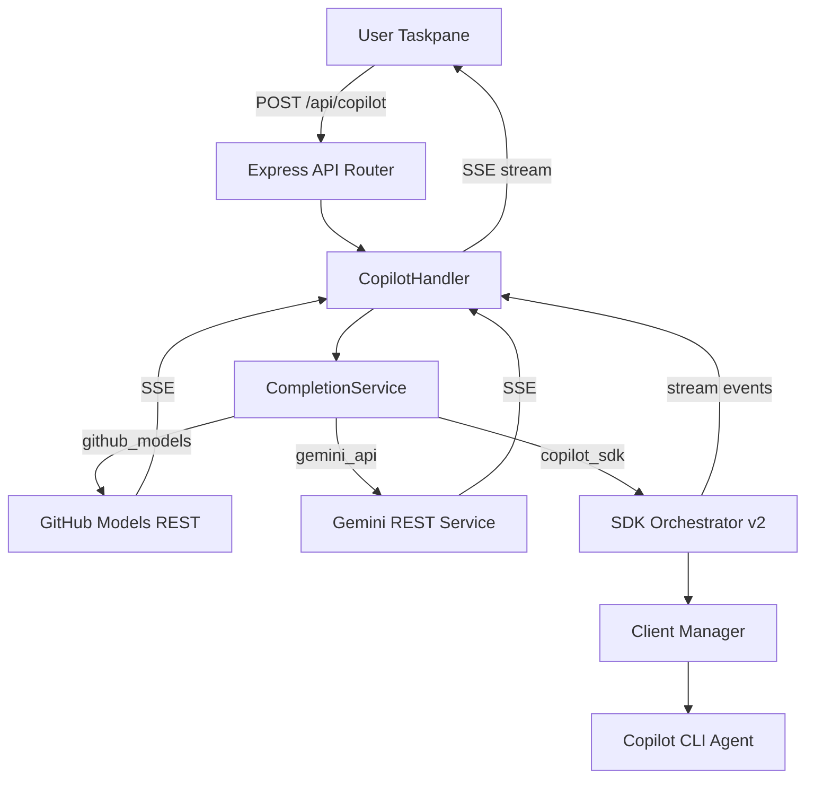
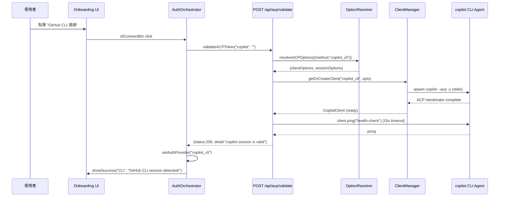
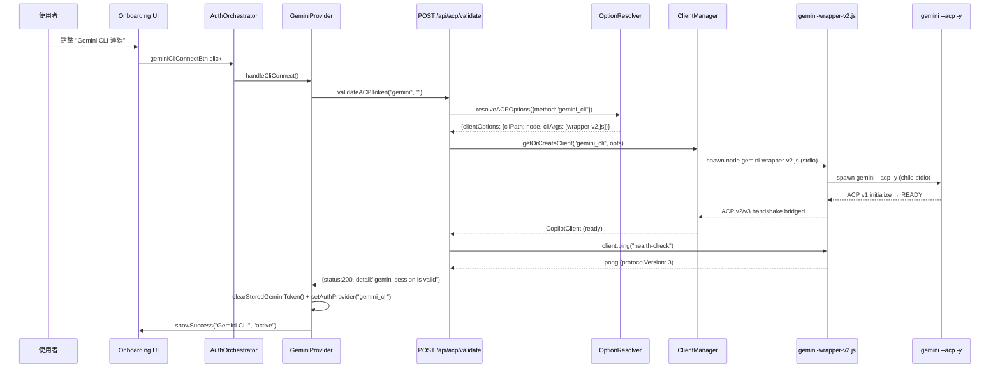
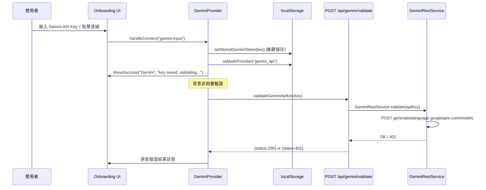

# 001 — 現有架構規格說明 (Current Architecture Specification)

> **版本**: 1.3  
> **建立日期**: 2026-04-01  
> **更新日期**: 2026-03-25  
> **狀態**: ✅ 已完成 (連線機制驗證完畢)  
> **分支**: `gemini`

---

## 1. 專案概述 (Project Overview)

**Github_Copilot_SDK_addin** 是一個 Microsoft Office Add-in（Word/Excel/PowerPoint），整合 AI 能力至 Office 應用程式內部。透過 GitHub Copilot SDK、Google Gemini、Azure OpenAI 等多個 AI 提供者，在 Office Taskpane 中提供生成式 AI 輔助寫作、文件分析與內容操作功能。

### 核心價值
- 在 Word 中直接使用 AI 生成、翻譯、改寫、摘要文件
- 支援多種 AI 提供者切換（Copilot CLI / Gemini API / Azure BYOK）
- 即時 SSE 串流回應，搭配 Markdown 渲染
- 互動式 AI 對話（`ask_user` 協議支援下拉選單、多選框）
- 18+ 種 Office 動作：文字插入/置換、標題、表格、圖片、追蹤修訂等

---

## 2. 技術堆疊 (Tech Stack)

| 層級 | 技術 |
|------|------|
| **前端** | TypeScript + Vanilla DOM, Tailwind CSS v4, Webpack 5, Office.js |
| **後端** | Express 5.x + TypeScript, ESM modules, HTTPS with self-signed certs |
| **AI SDK** | `@github/copilot-sdk ^0.2.0`, `@google/gemini-cli ^0.34.0` |
| **建置** | Webpack (3 entry points: polyfill, taskpane, commands), Babel, PostCSS |
| **測試** | Mocha + Supertest |
| **開發** | tsx watch mode, webpack-dev-server (port 3000), Express (port 4000) |

---

## 3. 架構設計模式 (Architecture Pattern)

### 3.1 Atomic Design（原子化設計）

全專案統一採用 Atomic Design 架構：

```
atoms/       → 最小功能單元（type definitions, config constants, pure utilities）
molecules/   → 組合多個 atoms 的功能模組（client-manager, session-lifecycle, SSE parser）
organisms/   → 完整業務邏輯的端到端服務（orchestrators, completion service, routes）
ecosystems/  → 系統啟動入口（server-entry.ts）
```

此模式同時應用於：
- **後端服務層** (`server/services/copilot/atoms|molecules|organisms`)
- **後端路由層** (`server/routes/atoms|molecules|organisms`)
- **後端基礎設施** (`server/atoms|molecules|organisms|ecosystems`)
- **前端服務層** (`src/taskpane/services/atoms|molecules|organisms`)
- **前端 UI 元件** (`src/taskpane/components/atoms|molecules|organisms`)

### 3.2 Multi-Provider AI Gateway



### 3.3 SSE 串流管線

端到端的即時串流架構：
1. SDK events / REST SSE → **Server** `CompletionService` async generator
2. Express SSE → 設定 `text/event-stream` headers + 2KB padding bypass proxy buffering
3. Frontend `ReadableStream` → `STREAM_DECODER.decodeSSE()` → 即時 DOM 更新

---

## 4. 後端架構詳解 (Backend Architecture)

### 4.1 啟動流程

```
server-entry.ts (ecosystem)
  └→ ServerOrchestrator.start() (organism)
       ├→ AppFactory.create() (molecule) — Express + CORS + body-parser
       │    ├→ mount /auth → AuthRouter
       │    └→ mount /api  → ApiRouter
       ├→ resolve HTTPS certs
       ├→ start HTTP/HTTPS on port 4000
       ├→ register cleanup handlers (SignalGuardian)
       └→ optional: warmUpClient() in dev mode
```

### 4.2 服務層 — Copilot Services

#### Atoms（原子層）
| 模組 | 用途 |
|------|------|
| `types.ts` | 核心型別：`ACPConnectionMethod` (4 種), `AuthProvider`, `ACPOptions`, `WritingPreset`, `OfficeAction` |
| `core-config.ts` | SDK 常數：300s 生成逾時, 30s/45s client 啟動逾時, watchdog 間隔 |
| `formatters.ts` | 回應文字擷取、模擬 chunking、錯誤格式化 |
| `presets.ts` | 5 個寫作預設：一般/會議記錄/正式備忘/提案/摘要報告 |
| `prompt-template.ts` | 中文專業寫作指令範本 |
| `system-identity.ts` | 系統訊息組裝（preset + persona + format） |
| `word-instructions.ts` | `<office-action>` XML 標記指令 |

#### Molecules（分子層）
| 模組 | 用途 |
|------|------|
| `client-manager.ts` | CopilotClient 連線池：30 分鐘 TTL, 5 分鐘健康檢查, 去重並行建立 |
| `option-resolver.ts` | ACP 選項解析：根據 model/Azure/remote 判斷最佳連接方式 |
| `session-lifecycle.ts` | SDK session 生命週期管理：建立/清理/工具注入/串流事件接線 |
| `pending-input-queue.ts` | `ask_user` 互動佇列：Promise-based, 180s 逾時, 最多 100 排隊 |
| `sse-parser.ts` | SSE AsyncGenerator：解碼 ReadableStream 為 JSON data lines |
| `response-parser.ts` | `<office-action>` XML 標記解析：回傳 `{cleanText, actions[]}` |
| `adaptive-config.ts` | 環境判斷（commercial/gcc/preview）、方法描述、可用方法列表 |
| `options/*.ts` | 4 種 ACP 方式的選項建構器 |
| `health/*.ts` | 3 種健康探測器（remote/azure/cli） |

#### Organisms（有機體層）
| 模組 | 用途 |
|------|------|
| `sdk-orchestrator-v2.ts` | **核心編排器**：建立 client → session → 發送 prompt → watchdog 監控（45s 無活動）→ 串流 delta 蒐集 → 重試邏輯 |
| `completion-service.ts` | **高階完成路由**：分流至 GitHub Models REST / Gemini REST / Copilot SDK |
| `prompt-orchestrator.ts` | Prompt 組裝：preset + word-action-guide + document context + user prompt |
| `gemini-rest-service.ts` | Gemini 直接 REST API：非串流/SSE 串流（400 錯誤自動降級）/金鑰驗證 |
| `github-models-service.ts` | GitHub Models 推論 API：SSE 串流/非串流 |
| `health-prober.ts` | ACP 健康探測與暖啟動 |
| `sdk-provider.ts` | 主入口：重新匯出所有 atoms/molecules、綁定 `sendPromptViaCopilotSdk` |

### 4.3 路由層

| 端點 | 方法 | 用途 |
|------|------|------|
| `GET /api/config` | GET | 取得 model 清單、presets、標題、字型、auto-connect |
| `POST /api/copilot` | POST | 主要 AI 請求（SSE 串流 / JSON） |
| `POST /api/copilot/response` | POST | 回應 `ask_user` 互動輸入 |
| `POST /api/acp/validate` | POST | 驗證 ACP 連接（copilot/gemini/azure） |
| `POST /api/gemini/validate` | POST | 驗證 Gemini API key |
| `GET /api/health` | GET | SDK 健康檢查 |
| `GET /auth/github` | GET | GitHub OAuth 授權重導向 |
| `GET /auth/callback` | GET | OAuth callback 交換 token |
| `GET /auth/session/:id` | GET | 輪詢 OAuth session store |

### 4.4 設定管理

```
server/config/
  ├── atoms/base-env.ts     → dotenv 載入 + 原始環境變數預設值
  └── molecules/
       ├── server-config.ts  → 統一配置介面（model lists, credentials, feature flags）
       └── config-validator.ts → 啟動時驗證 API Token / Port / 模型設定
```

---

## 5. 前端架構詳解 (Frontend Architecture)

### 5.1 啟動流程

```
taskpane.html
  └→ taskpane-entry.ts — TaskpaneController.init()
       ├→ 偵測 ?oauth= URL 參數 → 渲染 OAuth 對話框
       ├→ fetchConfig() → 取得伺服器設定
       ├→ renderAtomicDesign() → 建立完整 UI 元件樹
       ├→ createAuthController() → AuthOrchestrator 初始化
       │    ├→ 檢查 localStorage 已存 auth state → 恢復 session
       │    └→ 無 auth → 顯示 Onboarding 畫面
       ├→ bindAuthButtons() → 綁定所有認證按鈕事件
       ├→ auto-connect CLI（開發模式）
       └→ startHealthCheck() → 30s 間隔輪詢 /api/config
```

### 5.2 UI 元件樹

```
Header (organism)
  └→ StatusBanner (molecule) — 連線狀態 + 提供者名稱

HistoryContainer (organism)
  ├→ WelcomeMessage (molecule) — 初始歡迎訊息
  └→ ChatBubble (molecule) * N
       ├→ User bubble (藍色圓角)
       └→ Assistant card (玻璃卡片 + Markdown + 動作按鈕)

PromptGroup (molecule)
  ├→ ModelSelector (molecule) — 模型下拉選單
  └→ Textarea + Send Button (atoms)

Onboarding (organism)
  ├→ Accordion (molecule) × 3 — Google Gemini / GitHub Copilot / Azure OpenAI
  └→ Preview Mode (skip button)
```

### 5.3 認證與連線系統 (Authentication & Connection System)

#### 5.3.1 認證架構概覽

認證系統橫跨前後端四層：

```
┌─────────────────────────────────────────────────────────────────────┐
│  Layer 1: UI 入口（Onboarding Accordion）                            │
│  src/taskpane/components/organisms/Onboarding.ts                    │
│  ├→ Google Gemini 手風琴：Gemini CLI / Gemini API Key              │
│  ├→ GitHub Copilot 手風琴：Copilot CLI / PAT / OAuth               │
│  ├→ Azure OpenAI 手風琴：BYOK (Key + Endpoint + Deployment)        │
│  └→ Preview Mode (跳過驗證)                                         │
├─────────────────────────────────────────────────────────────────────┤
│  Layer 2: Auth Orchestrator（前端協調器）                             │
│  src/taskpane/services/auth/orchestrator.ts                         │
│  ├→ AuthOrchestrator：統一管理所有 provider 的狀態切換               │
│  ├→ GitHubProvider：PAT 輸入、OAuth Dialog、ACP 驗證               │
│  ├→ GeminiProvider：API Key 樂觀儲存 + CLI ACP 驗證                │
│  └→ AuthUIBridge：將 auth 事件轉為 UI 狀態更新                     │
├─────────────────────────────────────────────────────────────────────┤
│  Layer 3: 驗證 API（後端路由）                                       │
│  server/routes/organisms/api-router.ts                               │
│  ├→ POST /api/acp/validate    — ACP JSON-RPC Ping 驗證              │
│  ├→ POST /api/gemini/validate — Gemini REST API Key 驗證            │
│  └→ GET  /auth/github         — GitHub OAuth 重導向 + callback      │
├─────────────────────────────────────────────────────────────────────┤
│  Layer 4: SDK Client Lifecycle（後端服務）                            │
│  server/services/copilot/molecules/client-manager.ts                 │
│  ├→ getOrCreateClient()  — 連線池管理（30min TTL, 去重並行建立）     │
│  ├→ ACP Handshake        — CopilotClient.start() + ping health-check│
│  └→ cleanupAll()         — 信號守衛觸發的全域清理                    │
└─────────────────────────────────────────────────────────────────────┘
```

#### 5.3.2 支援的 8 種認證模式

| # | 模式 | Provider | 認證方式 | 需要使用者輸入 | 後端驗證端點 |
|---|------|----------|----------|----------------|--------------|
| 1 | `copilot_cli` | GitHub | 本地 Copilot CLI Agent (ACP stdio) | ❌ 自動偵測 | `POST /api/acp/validate` |
| 2 | `copilot_pat` | GitHub | Personal Access Token 手動輸入 | ✅ PAT Token | `POST /api/acp/validate` |
| 3 | `copilot_oauth` | GitHub | OAuth 2.0 授權碼流程（目前模擬） | ✅ 授權按鈕 | `GET /auth/github` |
| 4 | `gemini_api` | Google | Gemini REST API Key | ✅ API Key | `POST /api/gemini/validate` |
| 5 | `gemini_cli` | Google | 本地 Gemini CLI Agent (ACP stdio) | ❌ 本機 Google OAuth | `POST /api/acp/validate` |
| 6 | `azure_byok` | Azure | Azure OpenAI BYOK (Key+Endpoint+Deployment) | ✅ 三個欄位 | `POST /api/acp/validate` |
| 7 | `github_models` | GitHub | GitHub Models 推論 API | ✅ PAT Token | `POST /api/acp/validate` |
| 8 | `preview` | — | 跳過驗證（預覽模式） | ❌ | 無 |

#### 5.3.3 登入連線流程詳解

##### A. Copilot CLI 連線流程



**關鍵實作細節**：
- CLI agent 透過 `@github/copilot-sdk` 的 `CopilotClient` 以 **stdio** 模式啟動
- 本地端不需要任何 Token — 使用已登入的 `gh` CLI session
- 開發模式 (`AUTO_CONNECT_CLI=true`) 會在載入後 500ms **自動觸發**此流程

##### B. Gemini CLI 連線流程



**關鍵實作細節**：
- Gemini CLI 使用的是**本機 Google OAuth 憑證** (`~/.gemini/auth`)，**不需要** `GEMINI_API_KEY`
- 因為 Copilot SDK 使用 ACP v2/v3 而 Gemini CLI 使用 ACP v1，中間透過 **Bridge Wrapper** (`scripts/gemini-wrapper-v2.js`) 進行協定轉譯
- Wrapper 將 SDK 的 `session.create` 轉為 CLI 的 `session/new`，串流 `session/update` 轉為 `assistant.message_delta`
- `GEMINI_API_KEY` 環境變數會從子進程 env 中**排除**（空值會誤導 CLI 進入 API Key 認證模式）

##### C. Gemini API Key 連線流程



**關鍵實作細節**：
- 採用**樂觀儲存**策略 — 先存 token + 切換 UI，背景驗證不阻塞使用者體驗
- 驗證失敗時僅更新狀態文字，不清除已儲存的 key
- API Key 透過 `X-Gemini-Key` header 傳至後端

##### D. Azure OpenAI BYOK 連線流程

```
使用者輸入 (Key + Endpoint + Deployment)
  → AuthOrchestrator.azureConnectBtn click
    → validateACPToken("azure", key, endpoint, deployment)
      → POST /api/acp/validate {method:"azure", token:key, endpoint, deployment}
        → resolveACPOptions({method:"azure_byok", azure:{apiKey, endpoint, deployment}})
          → Client: CopilotClient({provider:{type:"azure", baseUrl, apiKey, azure:{apiVersion}}})
            → client.start() + client.ping()
              → ✅ setStoredAzureConfig(key, endpoint, deployment)
              → ✅ setAuthProvider("azure_byok")
```

##### E. GitHub OAuth 流程（模擬）

```
使用者點擊 "GitHub OAuth"
  → GitHubProvider.handleOAuthConnect()
    → Office.context.ui.displayDialogAsync(taskpane.html?oauth=github-preview)
      → 對話框渲染預覽狀態
      → 2 秒後自動關閉
      → completeAuth("gho_simulated_oauth_token_for_preview")
        → validateACPToken("copilot", fakeToken)
          → setStoredToken(token) + showSuccess()
```

> ⚠️ OAuth 目前為**模擬流程**。真實 OAuth 需設定 `GITHUB_CLIENT_ID` + `GITHUB_CLIENT_SECRET`，並經由 `GET /auth/github` → GitHub 授權頁 → `GET /auth/callback` 完成 code-for-token 交換。

##### F. Preview Mode（預覽模式）

```
使用者點擊 "跳過登入"
  → setAuthProvider("preview")
    → showSuccess("Preview", "Preview mode active.")
      → 進入主介面，但 AI 請求可能受限
```

#### 5.3.4 ACP 驗證協定 (POST /api/acp/validate)

統一驗證端點，支援三種 `method`：`copilot` / `gemini` / `azure`

```typescript
// 前端呼叫
validateACPToken(method, token?, endpoint?, deployment?)

// 後端處理流程
1. 接收 { method, token, endpoint, deployment }
2. 映射 method → ACPConnectionMethod:
   "azure"   → "azure_byok"
   "gemini"  → "gemini_cli"
   "copilot" → "copilot_cli"
3. resolveACPOptions() → 建構 clientOptions + sessionOptions
4. getOrCreateClient() → 從連線池取得或建立新 CopilotClient
5. client.ping("health-check") [15 秒逾時]
6. 成功 → {status:200, detail:"...session is valid via ACP"}
7. 失敗 → {status:401, detail:"Invalid credentials or ACP failure"}
```

#### 5.3.5 Session 恢復機制

應用程式啟動時的認證狀態恢復邏輯：

```typescript
// AuthOrchestrator.initialize()
if (hasStoredAuthState()) {
  // localStorage 中有已存的 provider
  const provider = getAuthProvider();

  // 特殊處理：gemini_cli 不需要保留 geminiToken
  if (provider === "gemini_cli") clearStoredGeminiToken();

  // 特殊處理：gemini_api 需要有效 key
  if (provider === "gemini_api" && !getStoredGeminiToken()) {
    setAuthProvider("preview");  // 降級為預覽模式
  }

  // 直接恢復 UI 狀態（不重新驗證）
  showSuccess(provider);
} else {
  showOnboarding();  // 顯示登入畫面
}
```

> 注意：Session 恢復時**不會重新驗證** token。這意味著過期的 token 會在首次 AI 請求時才被發現。

#### 5.3.6 前端儲存結構 (localStorage)

| Key | 儲存內容 | 寫入時機 |
|-----|---------|---------|
| `copilot_token` | GitHub PAT / OAuth token | PAT 輸入、OAuth callback |
| `gemini_token` | Gemini API Key | API Key 輸入 |
| `auth_provider` | 目前認證模式 (string) | 任何登入成功後 |
| `azure_config` | `{key, endpoint, deployment}` JSON | Azure BYOK 驗證成功後 |
| `active_model` | 目前選擇的 AI 模型 | 模型切換時 |
| `model_mode` | `"auto"` / `"manual"` | 模式切換時 |
| `selected_preset` | 寫作預設 ID | Preset 切換時 |

#### 5.3.7 後端認證路由 (/auth)

| 端點 | 方法 | 用途 | 關鍵實作 |
|------|------|------|---------|
| `/auth/github` | GET | OAuth 授權入口 | 重導向至 `github.com/login/oauth/authorize` |
| `/auth/callback` | GET | OAuth callback | 交換 code → access_token，存入 SessionStore |
| `/auth/session/:id` | GET | Token 輪詢 | 前端 polling 取回 OAuth token |

**SessionStore** (`server/routes/molecules/session-store.ts`)：
- 記憶體 Map，60 秒自動過期
- 用於 OAuth 流程中瀏覽器 → taskpane 的 token 傳遞

#### 5.3.8 多層級環境變數隔離 (Multi-layer Env Isolation)

為確保 Gemini CLI 優先使用本機 OAuth 認證而非 API Key，系統實施了兩層強制隔離：

1.  **第一層 (Server Level)**：在 `gemini-cli-options.ts` 中，構造子進程 `env` 時，顯式將 `GEMINI_API_KEY` 從 `process.env` 中解構並移除。
2.  **第二層 (Bridge Level)**：在 `scripts/gemini-wrapper/organisms/cli-adapter.js` 中，再次對 `spawn` 環境執行過濾。

> [!IMPORTANT]
> 此機制是為了解決 `gemini-cli v0.34+` 的行為：只要 `GEMINI_API_KEY` 存在於環境變數中（即使是空字串），CLI 就會嘗試 API Key 認證模式而導致連線失敗。

#### 5.3.9 SDK 補丁系統 (Atomic Patching System)

系統前端啟動前會套用由 `scripts/patch-copilot-sdk.mjs` 管理的原子化補丁，修復 Windows 下的 stdio 阻塞、ESM 相容性、以及 Gemini 參數衝突等原生 SDK 缺陷。

| 補丁名稱 | 修復目標 | 關鍵原理 |
|----------|----------|----------|
| `fix-spawn-windows` | Windows 路徑相容性 | 將 `spawn` 改為 Windows 相容模式，防止 stdio 阻塞。 |
| `fix-gemini-unsupported-flags` | 參數相容性 | 移除 SDK 硬編碼的 `--experimental-acp` 等舊 flag。 |
| `fix-exists-sync-check` | 啟動檢查 | 修復 Windows 下對 `cliPath` 存在性檢查失敗的問題。 |
| `fix-mutual-exclusive-check` | 認證邏輯 | 允許在具備本地 CLI 憑證時也定義 API Key，防止內部過度校驗。 |

#### 5.3.10 Bridge 轉譯深度詳解 (Protocol V3 ↔ V1)

`gemini-wrapper-v2.js` 負責將 SDK 的 V2/V3 協定對映至 CLI 的 V1 協定，並處理串流轉換與權限自動核准。它維護了一個 `cliId` 與 `sdkId` 的映射表，確保非同步訊息能正確路由回對應的 Session。

### 5.4 聊天流程

```
使用者輸入 → ChatOrchestrator.handleSend()
  ├→ prepare UI（停用輸入、顯示 typing indicator）
  ├→ 建立 assistant bubble（骨架載入）
  ├→ 取得 Word 文件上下文
  ├→ sendToCopilot() — POST /api/copilot
  │    ├→ SSE 串流 → onChunk callback → 即時更新 bubble
  │    └→ [ASK_USER]: 協議 → 渲染互動表單
  ├→ 完成 bubble（Markdown 渲染）
  ├→ 渲染動作按鈕（Apply to Word / Copy）
  └→ finalize（重新啟用輸入）
```

### 5.5 Office 整合

**Word**（完整功能）：18+ 種動作類型
- 文字：insert/replace text, headings (H1-H6), bullets, numbered lists
- 格式：bold/italic/underline, font-size/family/color, alignment, indent
- 結構：tables, images (base64), comments, tracked changes, TOC, page numbers, headers/footers
- 串流插入：25 字元區塊 + 10ms 延遲 + 每 20 區塊 sync

**Excel**（基本功能）：cell-based 插入、表格、格式化、項目清單

**PowerPoint**（最小功能）：純文字插入（text coercion API）

---

## 6. 開發工具與腳本 (Dev Tooling)

### 6.1 自動化熱重載 (Hot Reloading)

- **後端**: 使用 `tsx watch` 監控 `server/` 目錄，變更後自動重啟。
- **前端**: Webpack Dev Server 提供 HMR。
- **Office**: Office.js 自動偵測伺服器重啟並維持連線。

### 6.2 建置配置

- **Webpack 3 entry points**: `polyfill` (core-js), `taskpane` (主應用), `commands` (Office ribbon)
- **Dev proxy**: `/api` + `/auth` → `https://localhost:4000`（SSE 相容：`x-accel-buffering: no`, 停用壓縮）
- **PostCSS**: Tailwind CSS v4 整合

---

## 7. 資料流總覽 (Data Flow Overview)

```mermaid
flowchart LR
  subgraph Frontend
    UI[Taskpane UI]
    CO[ChatOrchestrator]
    AO[API Orchestrator]
    WI[Word Integrator]
    SD[Stream Decoder]
  end

  subgraph Backend
    AR[API Router]
    CH[Copilot Handler]
    CS[CompletionService]
    PO[Prompt Orchestrator]
  end

  subgraph Providers
    GMS[GitHub Models]
    GRS[Gemini REST]
    SDK[Copilot SDK CLI]
  end

  UI -->|使用者輸入| CO
  CO -->|POST /api/copilot| AO
  AO -->|HTTP + SSE| AR
  AR --> CH
  CH --> CS
  CS --> PO
  PO -->|組裝 prompt| CS
  CS --> GMS
  CS --> GRS
  CS --> SDK
  GMS -->|SSE chunks| CH
  GRS -->|SSE chunks| CH
  SDK -->|message_delta| CH
  CH -->|data: {text}| AO
  AO -->|stream| SD
  SD -->|chunks| CO
  CO -->|更新 bubble| UI
  CO -->|applyContent| WI
  WI -->|Word.run()| Office[Word Document]
```

---

## 8. 安全考量 (Security Considerations)

- **HTTPS**: 自簽憑證（開發環境），生產環境需替換
- **CORS**: 啟用但需嚴格設定 origin
- **Token 儲存**: 前端使用 `localStorage`（需評估 token 機密性）
- **API Key 傳輸**: Gemini key 透過 `X-Gemini-Key` header + `Authorization: Bearer` + URL `?key=` 三重機制
- **OAuth**: 目前為模擬流程（fake token `gho_simulated_oauth_token_for_preview`）
- **速率限制**: 尚未實作
- **輸入驗證**: 基本的 body parser，缺乏 payload schema 驗證

---

## 9. 已完成功能清單 (Completed Features)

- [x] 環境變數嚴格驗證 (Config Validator)
- [x] SDK 併發控制 (Race Condition Fix)
- [x] 對話紀錄持久化 (Conversation Persistence) — localStorage 最近 10 筆
- [x] 互動式提問 (Rich UI Ask User) — 下拉選單 + 多選框
- [x] 錯誤復原機制 (Retry Logic) — 氣泡內重新傳送按鈕
- [x] 組件原子化 (Atomic Design Refinement)
- [x] Gemini Bridge (ACP to NDJSON, 解決 API Key 衝突 Bug)
- [x] Gemini REST API 整合（SSE 串流 + 非串流降級）
- [x] GitHub Models REST 整合
- [x] 官方 Copilot CLI 串聯 (Verified with gh auth login)
- [x] 資源釋放機制 (AbortSignal 全鏈路中斷支持)
- [x] 長文插入卡頓修復 (Word 串流批次交易化)
- [x] 連線池精確清理 (Surgical cleanup during retry)
- [x] 連線錯誤攔截機制 (提供 `gemini auth` 建議)
- [x] 安全性加固 (Session UUID + Security Headers)
- [x] 異步計時器優化 (`timer.unref()` 處理)
- [x] 多 Office Host 支援 (Word/Excel/PowerPoint)
- [x] 自動伺服器探索 (HTTPS/HTTP port 4000/3000)

---

## 10. 專案結構摘要 (Project Structure)

```
Github_Copilot_SDK_addin/
├── manifest.xml                    → Office Add-in manifest
├── package.json                    → Root dependencies & scripts
├── webpack.config.js               → Build config (3 entries)
├── babel.config.json               → Babel TS support
├── postcss.config.js               → Tailwind CSS v4
├── eslint.config.mjs               → ESLint flat config
│
├── server/                         → Backend (Express + TypeScript, ESM)
│   ├── ecosystems/server-entry.ts  → Entry point
│   ├── organisms/                  → Server orchestrator
│   ├── molecules/                  → App factory, HTTPS, cleanup
│   ├── config/                     → Environment & server config
│   ├── routes/                     → HTTP API (atoms/molecules/organisms)
│   ├── services/copilot/           → AI service layer (atoms/molecules/organisms)
│   └── tests/                      → Integration tests
│
├── src/                            → Frontend (TypeScript + Vanilla DOM)
│   ├── taskpane/
│   │   ├── organisms/taskpane-entry.ts → Main controller
│   │   ├── components/             → UI components (atoms/molecules/organisms)
│   │   ├── services/               → Business logic (atoms/molecules/organisms)
│   │   │   ├── auth/               → Auth providers (github, gemini, orchestrator)
│   │   │   ├── word/               → Word integration (context, streaming, actions)
│   │   │   └── ...
│   │   └── styles/tailwind.css     → Tailwind entry
│   └── commands/                   → Office ribbon commands
│
├── scripts/                        → Dev tooling, SDK patches, Gemini wrapper
├── specs/                          → SDD specifications (this directory)
└── copilot_sdk_connection_methods/ → Architecture documentation
```
