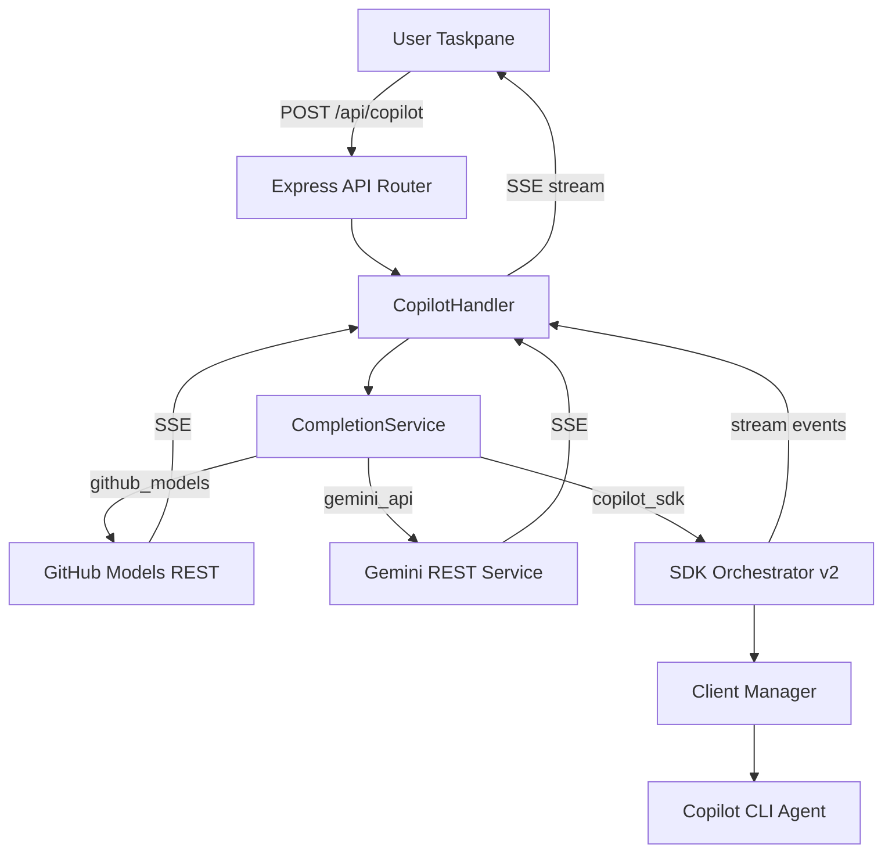

# 001 — 現有架構規格說明 (Current Architecture Specification)

> **版本**: 1.0  
> **建立日期**: 2026-04-01  
> **狀態**: ✅ 已完成  
> **分支**: `gemini`

---

## 1. 專案概述 (Project Overview)

**Github_Copilot_SDK_addin** 是一個 Microsoft Office Add-in（Word/Excel/PowerPoint），整合 AI 能力至 Office 應用程式內部。透過 GitHub Copilot SDK、Google Gemini、Azure OpenAI 等多個 AI 提供者，在 Office Taskpane 中提供生成式 AI 輔助寫作、文件分析與內容操作功能。

### 核心價值
- 在 Word 中直接使用 AI 生成、翻譯、改寫、摘要文件
- 支援多種 AI 提供者切換（Copilot CLI / Gemini API / Azure BYOK）
- 即時 SSE 串流回應，搭配 Markdown 渲染
- 互動式 AI 對話（`ask_user` 協議支援下拉選單、多選框）
- 18+ 種 Office 動作：文字插入/置換、標題、表格、圖片、追蹤修訂等

---

## 2. 技術堆疊 (Tech Stack)

| 層級 | 技術 |
|------|------|
| **前端** | TypeScript + Vanilla DOM, Tailwind CSS v4, Webpack 5, Office.js |
| **後端** | Express 5.x + TypeScript, ESM modules, HTTPS with self-signed certs |
| **AI SDK** | `@github/copilot-sdk ^0.2.0`, `@google/gemini-cli ^0.34.0` |
| **建置** | Webpack (3 entry points: polyfill, taskpane, commands), Babel, PostCSS |
| **測試** | Mocha + Supertest |
| **開發** | tsx watch mode, webpack-dev-server (port 3000), Express (port 4000) |

---

## 3. 架構設計模式 (Architecture Pattern)

### 3.1 Atomic Design（原子化設計）

全專案統一採用 Atomic Design 架構：

```
atoms/       → 最小功能單元（type definitions, config constants, pure utilities）
molecules/   → 組合多個 atoms 的功能模組（client-manager, session-lifecycle, SSE parser）
organisms/   → 完整業務邏輯的端到端服務（orchestrators, completion service, routes）
ecosystems/  → 系統啟動入口（server-entry.ts）
```

此模式同時應用於：
- **後端服務層** (`server/services/copilot/atoms|molecules|organisms`)
- **後端路由層** (`server/routes/atoms|molecules|organisms`)
- **後端基礎設施** (`server/atoms|molecules|organisms|ecosystems`)
- **前端服務層** (`src/taskpane/services/atoms|molecules|organisms`)
- **前端 UI 元件** (`src/taskpane/components/atoms|molecules|organisms`)

### 3.2 Multi-Provider AI Gateway



### 3.3 SSE 串流管線

端到端的即時串流架構：
1. SDK events / REST SSE → **Server** `CompletionService` async generator
2. Express SSE → 設定 `text/event-stream` headers + 2KB padding bypass proxy buffering
3. Frontend `ReadableStream` → `STREAM_DECODER.decodeSSE()` → 即時 DOM 更新

---

## 4. 後端架構詳解 (Backend Architecture)

### 4.1 啟動流程

```
server-entry.ts (ecosystem)
  └→ ServerOrchestrator.start() (organism)
       ├→ AppFactory.create() (molecule) — Express + CORS + body-parser
       │    ├→ mount /auth → AuthRouter
       │    └→ mount /api  → ApiRouter
       ├→ resolve HTTPS certs
       ├→ start HTTP/HTTPS on port 4000
       ├→ register cleanup handlers (SignalGuardian)
       └→ optional: warmUpClient() in dev mode
```

### 4.2 服務層 — Copilot Services

#### Atoms（原子層）
| 模組 | 用途 |
|------|------|
| `types.ts` | 核心型別：`ACPConnectionMethod` (4 種), `AuthProvider`, `ACPOptions`, `WritingPreset`, `OfficeAction` |
| `core-config.ts` | SDK 常數：300s 生成逾時, 30s/45s client 啟動逾時, watchdog 間隔 |
| `formatters.ts` | 回應文字擷取、模擬 chunking、錯誤格式化 |
| `presets.ts` | 5 個寫作預設：一般/會議記錄/正式備忘/提案/摘要報告 |
| `prompt-template.ts` | 中文專業寫作指令範本 |
| `system-identity.ts` | 系統訊息組裝（preset + persona + format） |
| `word-instructions.ts` | `<office-action>` XML 標記指令 |

#### Molecules（分子層）
| 模組 | 用途 |
|------|------|
| `client-manager.ts` | CopilotClient 連線池：30 分鐘 TTL, 5 分鐘健康檢查, 去重並行建立 |
| `option-resolver.ts` | ACP 選項解析：根據 model/Azure/remote 判斷最佳連接方式 |
| `session-lifecycle.ts` | SDK session 生命週期管理：建立/清理/工具注入/串流事件接線 |
| `pending-input-queue.ts` | `ask_user` 互動佇列：Promise-based, 180s 逾時, 最多 100 排隊 |
| `sse-parser.ts` | SSE AsyncGenerator：解碼 ReadableStream 為 JSON data lines |
| `response-parser.ts` | `<office-action>` XML 標記解析：回傳 `{cleanText, actions[]}` |
| `adaptive-config.ts` | 環境判斷（commercial/gcc/preview）、方法描述、可用方法列表 |
| `options/*.ts` | 4 種 ACP 方式的選項建構器 |
| `health/*.ts` | 3 種健康探測器（remote/azure/cli） |

#### Organisms（有機體層）
| 模組 | 用途 |
|------|------|
| `sdk-orchestrator-v2.ts` | **核心編排器**：建立 client → session → 發送 prompt → watchdog 監控（45s 無活動）→ 串流 delta 蒐集 → 重試邏輯 |
| `completion-service.ts` | **高階完成路由**：分流至 GitHub Models REST / Gemini REST / Copilot SDK |
| `prompt-orchestrator.ts` | Prompt 組裝：preset + word-action-guide + document context + user prompt |
| `gemini-rest-service.ts` | Gemini 直接 REST API：非串流/SSE 串流（400 錯誤自動降級）/金鑰驗證 |
| `github-models-service.ts` | GitHub Models 推論 API：SSE 串流/非串流 |
| `health-prober.ts` | ACP 健康探測與暖啟動 |
| `sdk-provider.ts` | 主入口：重新匯出所有 atoms/molecules、綁定 `sendPromptViaCopilotSdk` |

### 4.3 路由層

| 端點 | 方法 | 用途 |
|------|------|------|
| `GET /api/config` | GET | 取得 model 清單、presets、標題、字型、auto-connect |
| `POST /api/copilot` | POST | 主要 AI 請求（SSE 串流 / JSON） |
| `POST /api/copilot/response` | POST | 回應 `ask_user` 互動輸入 |
| `POST /api/acp/validate` | POST | 驗證 ACP 連接（copilot/gemini/azure） |
| `POST /api/gemini/validate` | POST | 驗證 Gemini API key |
| `GET /api/health` | GET | SDK 健康檢查 |
| `GET /auth/github` | GET | GitHub OAuth 授權重導向 |
| `GET /auth/callback` | GET | OAuth callback 交換 token |
| `GET /auth/session/:id` | GET | 輪詢 OAuth session store |

### 4.4 設定管理

```
server/config/
  ├── atoms/base-env.ts     → dotenv 載入 + 原始環境變數預設值
  └── molecules/
       ├── server-config.ts  → 統一配置介面（model lists, credentials, feature flags）
       └── config-validator.ts → 啟動時驗證 API Token / Port / 模型設定
```

---

## 5. 前端架構詳解 (Frontend Architecture)

### 5.1 啟動流程

```
taskpane.html
  └→ taskpane-entry.ts — TaskpaneController.init()
       ├→ 偵測 ?oauth= URL 參數 → 渲染 OAuth 對話框
       ├→ fetchConfig() → 取得伺服器設定
       ├→ renderAtomicDesign() → 建立完整 UI 元件樹
       ├→ createAuthController() → AuthOrchestrator 初始化
       │    ├→ 檢查 localStorage 已存 auth state → 恢復 session
       │    └→ 無 auth → 顯示 Onboarding 畫面
       ├→ bindAuthButtons() → 綁定所有認證按鈕事件
       ├→ auto-connect CLI（開發模式）
       └→ startHealthCheck() → 30s 間隔輪詢 /api/config
```

### 5.2 UI 元件樹

```
Header (organism)
  └→ StatusBanner (molecule) — 連線狀態 + 提供者名稱

HistoryContainer (organism)
  ├→ WelcomeMessage (molecule) — 初始歡迎訊息
  └→ ChatBubble (molecule) * N
       ├→ User bubble (藍色圓角)
       └→ Assistant card (玻璃卡片 + Markdown + 動作按鈕)

PromptGroup (molecule)
  ├→ ModelSelector (molecule) — 模型下拉選單
  └→ Textarea + Send Button (atoms)

Onboarding (organism)
  ├→ Accordion (molecule) × 3 — Google Gemini / GitHub Copilot / Azure OpenAI
  └→ Preview Mode (skip button)
```

### 5.3 認證系統

支援 8 種前端認證模式：

| 模式 | Provider | 說明 |
|------|----------|------|
| `copilot_cli` | GitHub | 本地 Copilot CLI agent 透過 ACP |
| `copilot_pat` | GitHub | Personal Access Token |
| `copilot_oauth` | GitHub | OAuth 授權（模擬） |
| `gemini_api` | Google | Gemini API Key（樂觀儲存 + 背景驗證） |
| `gemini_cli` | Google | 本地 Gemini CLI agent 透過 ACP |
| `azure_byok` | Azure | Bring Your Own Key |
| `github_models` | GitHub | GitHub Models 推論 API |
| `preview` | — | 預覽模式（跳過驗證） |

### 5.4 聊天流程

```
使用者輸入 → ChatOrchestrator.handleSend()
  ├→ prepare UI（停用輸入、顯示 typing indicator）
  ├→ 建立 assistant bubble（骨架載入）
  ├→ 取得 Word 文件上下文
  ├→ sendToCopilot() — POST /api/copilot
  │    ├→ SSE 串流 → onChunk callback → 即時更新 bubble
  │    └→ [ASK_USER]: 協議 → 渲染互動表單
  ├→ 完成 bubble（Markdown 渲染）
  ├→ 渲染動作按鈕（Apply to Word / Copy）
  └→ finalize（重新啟用輸入）
```

### 5.5 Office 整合

**Word**（完整功能）：18+ 種動作類型
- 文字：insert/replace text, headings (H1-H6), bullets, numbered lists
- 格式：bold/italic/underline, font-size/family/color, alignment, indent
- 結構：tables, images (base64), comments, tracked changes, TOC, page numbers, headers/footers
- 串流插入：25 字元區塊 + 10ms 延遲 + 每 20 區塊 sync

**Excel**（基本功能）：cell-based 插入、表格、格式化、項目清單

**PowerPoint**（最小功能）：純文字插入（text coercion API）

---

## 6. 開發工具與腳本 (Dev Tooling)

### 6.1 SDK 補丁系統

```
scripts/patch-copilot-sdk.mjs
  ├→ atoms/fix-exists-sync-check.mjs
  ├→ atoms/fix-gemini-unsupported-flags.mjs
  ├→ atoms/fix-import-meta-resolve.mjs
  ├→ atoms/fix-jsonrpc-path.mjs
  ├→ atoms/fix-mutual-exclusive-check.mjs
  └→ atoms/fix-spawn-windows.mjs
```

### 6.2 建置配置

- **Webpack 3 entry points**: `polyfill` (core-js), `taskpane` (主應用), `commands` (Office ribbon)
- **Dev proxy**: `/api` + `/auth` → `https://localhost:4000`（SSE 相容：`x-accel-buffering: no`, 停用壓縮）
- **PostCSS**: Tailwind CSS v4 整合

---

## 7. 資料流總覽 (Data Flow Overview)

```mermaid
flowchart LR
  subgraph Frontend
    UI[Taskpane UI]
    CO[ChatOrchestrator]
    AO[API Orchestrator]
    WI[Word Integrator]
    SD[Stream Decoder]
  end

  subgraph Backend
    AR[API Router]
    CH[Copilot Handler]
    CS[CompletionService]
    PO[Prompt Orchestrator]
  end

  subgraph Providers
    GMS[GitHub Models]
    GRS[Gemini REST]
    SDK[Copilot SDK CLI]
  end

  UI -->|使用者輸入| CO
  CO -->|POST /api/copilot| AO
  AO -->|HTTP + SSE| AR
  AR --> CH
  CH --> CS
  CS --> PO
  PO -->|組裝 prompt| CS
  CS --> GMS
  CS --> GRS
  CS --> SDK
  GMS -->|SSE chunks| CH
  GRS -->|SSE chunks| CH
  SDK -->|message_delta| CH
  CH -->|data: {text}| AO
  AO -->|stream| SD
  SD -->|chunks| CO
  CO -->|更新 bubble| UI
  CO -->|applyContent| WI
  WI -->|Word.run()| Office[Word Document]
```

---

## 8. 安全考量 (Security Considerations)

- **HTTPS**: 自簽憑證（開發環境），生產環境需替換
- **CORS**: 啟用但需嚴格設定 origin
- **Token 儲存**: 前端使用 `localStorage`（需評估 token 機密性）
- **API Key 傳輸**: Gemini key 透過 `X-Gemini-Key` header + `Authorization: Bearer` + URL `?key=` 三重機制
- **OAuth**: 目前為模擬流程（fake token `gho_simulated_oauth_token_for_preview`）
- **速率限制**: 尚未實作
- **輸入驗證**: 基本的 body parser，缺乏 payload schema 驗證

---

## 9. 已完成功能清單 (Completed Features)

- [x] 環境變數嚴格驗證 (Config Validator)
- [x] SDK 併發控制 (Race Condition Fix)
- [x] 對話紀錄持久化 (Conversation Persistence) — localStorage 最近 10 筆
- [x] 互動式提問 (Rich UI Ask User) — 下拉選單 + 多選框
- [x] 錯誤復原機制 (Retry Logic) — 氣泡內重新傳送按鈕
- [x] 組件原子化 (Atomic Design Refinement)
- [x] Gemini REST API 整合（SSE 串流 + 非串流降級）
- [x] GitHub Models REST 整合
- [x] 多 Office Host 支援 (Word/Excel/PowerPoint)
- [x] 自動伺服器探索 (HTTPS/HTTP port 4000/3000)

---

## 10. 專案結構摘要 (Project Structure)

```
Github_Copilot_SDK_addin/
├── manifest.xml                    → Office Add-in manifest
├── package.json                    → Root dependencies & scripts
├── webpack.config.js               → Build config (3 entries)
├── babel.config.json               → Babel TS support
├── postcss.config.js               → Tailwind CSS v4
├── eslint.config.mjs               → ESLint flat config
│
├── server/                         → Backend (Express + TypeScript, ESM)
│   ├── ecosystems/server-entry.ts  → Entry point
│   ├── organisms/                  → Server orchestrator
│   ├── molecules/                  → App factory, HTTPS, cleanup
│   ├── config/                     → Environment & server config
│   ├── routes/                     → HTTP API (atoms/molecules/organisms)
│   ├── services/copilot/           → AI service layer (atoms/molecules/organisms)
│   └── tests/                      → Integration tests
│
├── src/                            → Frontend (TypeScript + Vanilla DOM)
│   ├── taskpane/
│   │   ├── organisms/taskpane-entry.ts → Main controller
│   │   ├── components/             → UI components (atoms/molecules/organisms)
│   │   ├── services/               → Business logic (atoms/molecules/organisms)
│   │   │   ├── auth/               → Auth providers (github, gemini, orchestrator)
│   │   │   ├── word/               → Word integration (context, streaming, actions)
│   │   │   └── ...
│   │   └── styles/tailwind.css     → Tailwind entry
│   └── commands/                   → Office ribbon commands
│
├── scripts/                        → Dev tooling, SDK patches, Gemini wrapper
├── specs/                          → SDD specifications (this directory)
└── copilot_sdk_connection_methods/ → Architecture documentation
```
